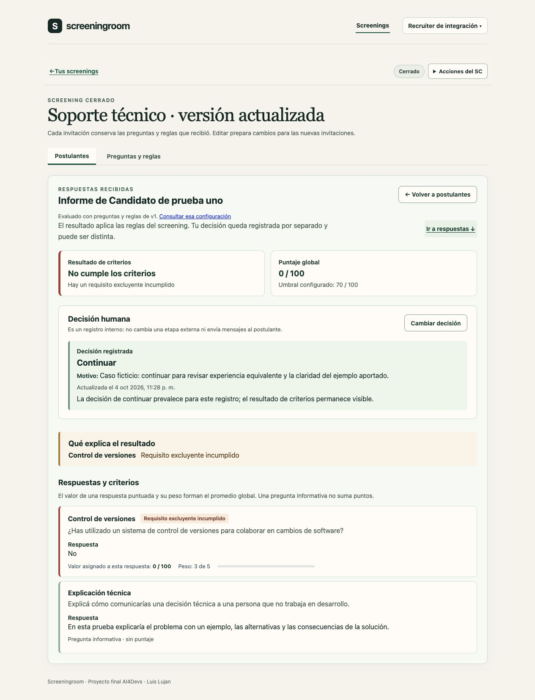
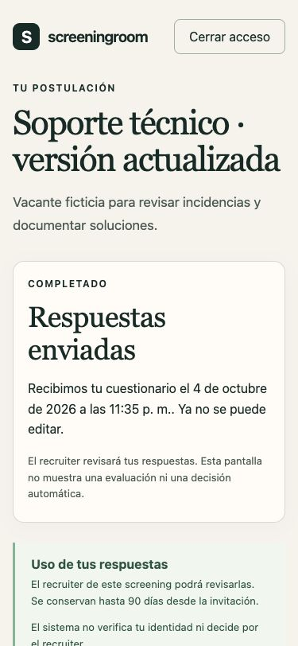

# Verificación integrada de entrega 2

04/10/2026, fecha local de trabajo. Los timestamps técnicos de GitHub y de la API pueden estar en UTC del 05/10. [README](../readme.md) · [Backlog](backlog.md) · [Harness](harness.md).

## Alcance y rama

Se integra el desarrollo de `feature/review-feedback-LL` en `feature/entrega-2-LL` del fork `luislujan32/AI4Devs-finalproject`. Código verificado: `6fc10fa`, que incluye el bloque de espacio recruiter/versiones `19ab360` y los ajustes de alineación. Entrega 1 conserva su rama documental. [PR #2 de integración](https://github.com/luislujan32/AI4Devs-finalproject/pull/2), con base `feature/entrega-2-LL` y head `feature/review-feedback-LL`. El [CI del código 6fc10fa](https://github.com/luislujan32/AI4Devs-finalproject/actions/runs/37256082953) terminó correctamente. El PR se fusionó con checks correctos en `7c7edf3`; el [CI de entrega 2 integrada](https://github.com/luislujan32/AI4Devs-finalproject/actions/runs/37256635258) también terminó correctamente. No se trabaja sobre el repositorio de la academia.

## Comprobaciones automatizadas

| Comprobación | Resultado local | Frontera comprobada |
| --- | --- | --- |
| check | Correcto | Tipos, lint, build web/API y OpenSpec |
| test:persistence | 14/14 | Modelos, índices, fixtures y CAS con MongoDB real |
| test:auth | 13/13 | Sesiones, ownership, CSRF, límites y HTTP real |
| test:screenings | 24/24 | Autoría, banco, publicación, listas de 101 registros, versiones y concurrencia |
| test:candidate | 7/7 | Invitación, correo de prueba, OTP/enlace, vigencia y sesión |
| test:attempt | 6/6 | Cálculo puro, borrador, envío, informe, revisión y cierre |
| smoke | Correcto | Aplicación compilada, HTTP y MongoDB |

Total: **64 pruebas automatizadas correctas**, además de smoke. Datos ficticios, bases de prueba aisladas y Mailpit local. No equivalen a una prueba de carga, auditoría de accesibilidad completa ni una suite automatizada de navegador.

## Recorrido manual del producto

Se sirvió el mismo build en un puerto temporal y una BD ficticia separada del entorno de pruebas de Luis. No se modificaron sus screenings ni cuentas.

1. Iniciar sesión como recruiter ficticio; crear un SC, editar título/área/descripción, agregar dos preguntas del banco y verificar que la ya agregada no se repite. Configurar pregunta Sí/No requerida y puntuable (peso 3, Sí 100, No 0, excluyente Sí), más texto opcional sin puntuar. Recargar y recuperar contenido y reglas.
2. Publicar v1 con umbral 70 e invitar al candidato uno. Editar el mismo SC: nuevo título y umbral 80; revisar diferencias y publicar v2. Invitar al candidato dos. Ambas invitaciones aparecen en una lista, identificadas como v1/v2; duplicar correo da error recuperable.
3. Abrir el primer correo de Mailpit: entra sin OTP, con título/preguntas v1. Responder No, guardar, recargar, cerrar acceso, pedir/validar OTP y recuperar el mismo avance. La sesión del recruiter sigue vigente.
4. Agregar respuesta de texto, revisar, confirmar y enviar sin un guardado manual adicional. Recargar: recibo persistido sin puntajes internos ni edición.
5. Consultar informe: v1, umbral 70, puntaje 0 y requisito excluyente incumplido. Registrar Continuar con motivo obligatorio; volver a lista y reabrir informe: decisión visible en modo lectura, cálculo original intacto.
6. Cerrar el SC y recargar. No se ofrecen nuevas invitaciones y los informes siguen disponibles. Abrir el correo del candidato dos, emitido antes del cierre: entra sin OTP y recibe v2.
7. Abrir dos pestañas del segundo intento, responder Sí/No distinto, guardar la primera e intentar guardar la segunda: conflicto visible sin perder la edición local. Recargar versión guardada exige confirmar descarte; después se recupera Sí.
8. Enviar el segundo intento con texto opcional vacío después del cierre. El recibo confirma envío y el recruiter ve Recibidas/Cumple/Sin decisión. El informe y la decisión del candidato uno siguen disponibles.

Editor y formulario se comprobaron a 375 × 812 px efectivos, sin desbordamiento horizontal; se utilizó teclado para confirmar el envío. La revisión visual de las columnas y botones a 1280/950/375/320 px está registrada en [el espacio recruiter](recruiter-workspace-foundations.md) y `prompts.md`, workflow 19. No se afirma una revisión de todos los dispositivos ni clientes de correo.

## Comparación con las entregas

**Entrega 1:** se mantiene el núcleo definido: preparar cuestionario, invitar, responder/retomar, evaluar determinísticamente y revisar por una persona. Las mejoras de UX, listas y versiones concretan ese contrato; editar solo futuras invitaciones es una decisión posterior explícita de Luis. No se añadieron etapas de contratación, comunicación de aclaraciones ni integraciones externas. El principal hueco del harness fue dejar estados de interacción, retorno y escala demasiado abiertos; el protocolo actual exige concretarlos antes del código y contrastar producto, UX y viabilidad cuando corresponda.

**Entrega 2 (22/10):** según el material aportado, requiere backend, frontend y BD conectados y flujo principal operativo aunque no esté completo. Ese recorrido está implementado y verificado localmente. La entrega formal aún requiere la rama/URL acordadas y el formulario del máster; el PR interno del fork no la sustituye. T-04 sigue pendiente como capacidad del MVP documentado, aunque no es necesario afirmar que todo el producto esté terminado para este hito.

**Entrega 3 (12/11):** hay tests unitarios/integración y registro de IA; faltan automatización E2E de navegador, despliegue, proveedor de correo externo/evidencia de funcionamiento reproducible, T-04 y cierre operativo de T-09. La demo local no acredita despliegue ni correo real.

## Pendientes concretos

- T-04: sugerencias de preguntas, salida validada, incorporación sin reglas automáticas, edición manual y recuperación; evaluación con el proveedor configurado.
- T-09: responsable/contacto del aviso, borrado anticipado con limpieza de sesiones asociadas y comprobación de conservación/operación antes de datos reales.
- T-10: E2E automatizado, hosting/HTTPS, correo externo, instrucciones y evidencia final.
- Decisión estratégica abierta: ampliar la duración de sesión del candidato (actualmente 2 horas). Las cookies separadas corrigen la interferencia de roles, sin cambiar ese plazo.
- UX evolutiva: probar con recruiters representativos y clientes de correo; banco personal, Kanban y aclaraciones reales requieren alcance propio.

## Cierre de especificaciones

Se sincronizaron ocho cambios con las especificaciones vivas y se archivaron siete completos en `openspec/changes/archive/2026-10-05-*` (fecha UTC de la CLI). `screening-workflow-ux` conserva una única tarea abierta: definir la ampliación de sesión. La sincronización preserva escenarios de ownership, conflicto e idempotencia y reconcilia las propuestas intermedias de copia con el contrato posterior de versiones dentro del mismo SC.

## Evidencia visual ficticia

El recibo se verificó visualmente a 375 y 320 px, con ancho de documento igual a su scrollWidth. La captura móvil de página completa del navegador produjo un reflujo artificial durante su generación, aunque la pantalla real era correcta; se reemplazó por la captura de viewport de 375 × 812, inspeccionada antes de guardar. No hubo cambio de CSS por ese artefacto.

