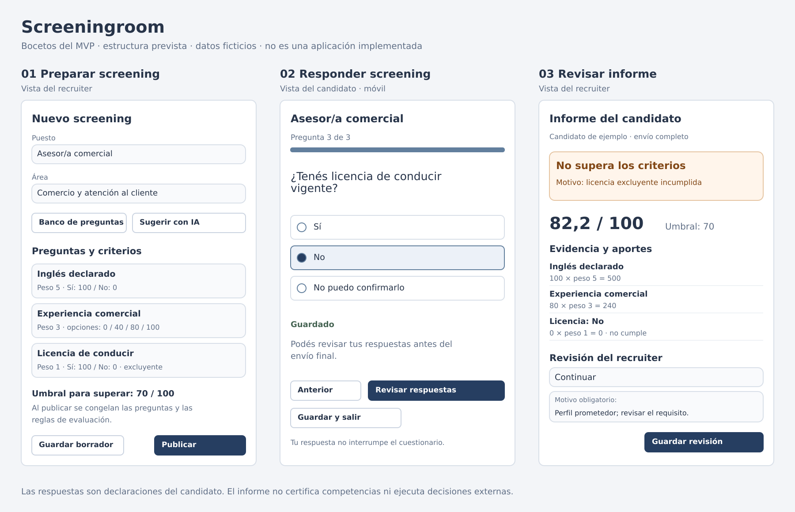
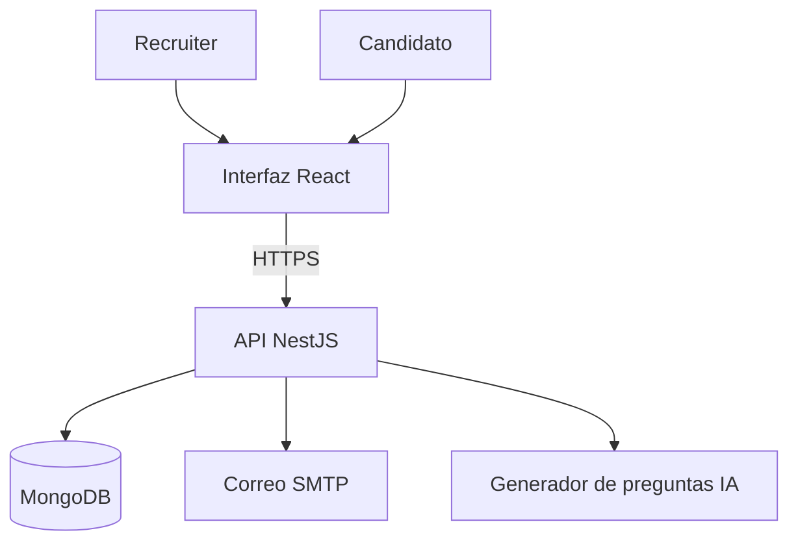
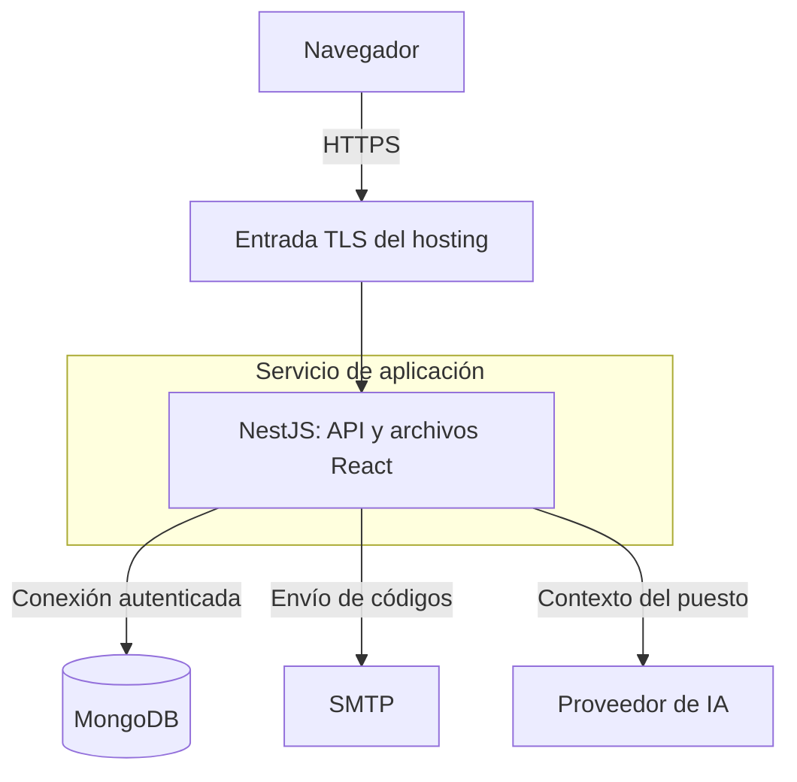
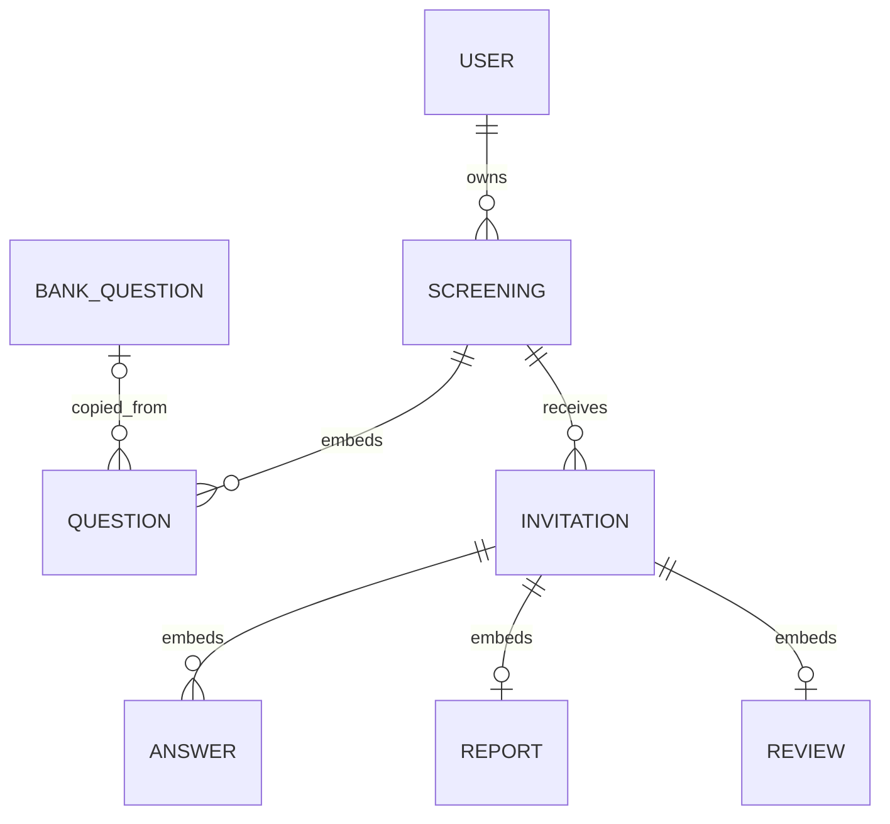

# Screeningroom — Proyecto final AI4Devs

**Entrega 1: documentación técnica · Luis Lujan (LL) · 23 de septiembre de 2026.**

Esta entrega define el MVP y su diseño. El código funcional corresponde a la entrega 2; las pruebas ejecutadas y la evidencia del producto se incorporarán durante el desarrollo.

## Índice

0. [Ficha del proyecto](#0-ficha-del-proyecto)
1. [Descripción general del producto](#1-descripción-general-del-producto)
2. [Arquitectura del sistema](#2-arquitectura-del-sistema)
3. [Modelo de datos](#3-modelo-de-datos)
4. [Especificación de la API](#4-especificación-de-la-api)
5. [Historias de usuario](#5-historias-de-usuario)
6. [Tickets de trabajo](#6-tickets-de-trabajo)
7. [Pull requests](#7-pull-requests)

**Anexos:** [Reglas del producto](docs/producto.md) · [Backlog](docs/backlog.md) · [OpenAPI](docs/openapi.yaml) · [Registro de IA](prompts.md).

## 0. Ficha del proyecto

### 0.1. Autor

Luis Lujan. Proyecto individual con asistencia de ChatGPT y Codex.

### 0.2. Nombre

**Screeningroom.**

### 0.3. Descripción breve

Aplicación web de screening de candidatos. El recruiter prepara preguntas y criterios del puesto, asigna pesos y requisitos excluyentes y comparte una invitación individual. El candidato responde, revisa y retoma su avance sin crear una cuenta. El sistema genera un informe con puntuación, evidencia y faltantes; el recruiter registra su decisión por separado. Un banco por áreas y sugerencias de IA ayudan a preparar los cuestionarios.

### 0.4. URL de la aplicación

Se incorporará cuando exista un despliegue. Para esta primera entrega se presenta el diseño.

### 0.5. Repositorio

[Repositorio del proyecto](https://github.com/luislujan32/AI4Devs-finalproject). Rama de esta entrega: `feature/entrega-1-LL`.

## 1. Descripción general del producto

### 1.1. Objetivo

Screeningroom permite preparar un screening acorde al puesto y comprender sus resultados para decidir cómo continuar con una candidatura.

- **Recruiter:** configura los criterios y consulta un informe que muestra el origen de cada conclusión, sin ocultar información favorable detrás de un resultado general.
- **Candidato:** completa un recorrido breve, puede revisar y retomar sus respuestas y llega al final aunque no cumpla un requisito excluyente.

El producto admite distintos tipos de puestos. Las preguntas propias permiten trabajar en áreas que todavía no estén cubiertas por el banco inicial.

### 1.2. Características y funcionalidades principales

**Cinco capacidades principales:**

1. Preparar y publicar screenings con preguntas propias o del banco, pesos, condiciones excluyentes y umbral.
2. Obtener propuestas de preguntas mediante IA y revisarlas antes de incorporarlas.
3. Invitar a candidatos, validar su acceso por correo y permitir responder, guardar, retomar y enviar.
4. Consultar un informe por criterio, con evidencia y un resultado calculado de manera determinista.
5. Registrar la revisión del recruiter, incluso cuando su decisión difiera del resultado calculado.

Autenticación, control de acceso y conservación de datos sostienen estas capacidades; no son productos separados.

**Deseables posteriores al flujo principal:** exportación del informe y demostración de su consumo mediante un cliente externo genérico. No se promete una integración con un sistema concreto ni webhooks en el primer MVP.

**Evolución posterior:** WhatsApp, audio, interpretación de CV, certificación de competencias, assessments, entrevistas adaptativas, colaboración entre recruiters y subáreas del banco. No forman parte del compromiso inicial.

Las reglas de evaluación, publicación, banco y revisión humana se especifican en el [contrato funcional P-01 a P-08](docs/producto.md).

### 1.3. Diseño y experiencia de usuario

1. El recruiter inicia sesión con correo y contraseña. En el MVP las cuentas se aprovisionan mediante un comando administrativo; no se desarrolla registro público, roles complejos ni recuperación de contraseña por interfaz.
2. Crea el screening, elige área y agrega preguntas propias, del banco o sugeridas por IA. Confirma puntuación, pesos, excluyentes, obligatoriedad y umbral.
3. Publica una configuración válida. El cuestionario publicado queda inmutable; puede copiarlo a un borrador nuevo.
4. Registra el correo del candidato y obtiene un enlace individual para compartir. El nombre es opcional. Una invitación contiene un único intento; no hay importación masiva ni reintentos de evaluación en el MVP.
5. Al abrir el enlace, el candidato solicita un código enviado al correo registrado. El enlace por sí solo no permite leer el cuestionario ni respuestas. El código comprueba acceso al buzón, no identidad civil ni titularidad exclusiva.
6. El candidato lee el aviso de uso de datos, responde y guarda su avance. Puede salir y retomar mediante un nuevo acceso autorizado.
7. Revisa las respuestas y realiza el envío final. Una respuesta desfavorable nunca interrumpe el recorrido. Tras el envío no puede modificar respuestas; ve confirmación, no el informe interno.
8. El sistema conserva el envío y genera el informe. El recruiter lo revisa y registra continuar, no continuar o solicitar aclaración. Esta última opción registra una intención; no abre otro intento ni envía mensajes automáticamente.

**Parámetros iniciales de acceso:** invitación vigente durante 7 días; código aleatorio de 6 dígitos, de un solo uso, válido 10 minutos; máximo 5 verificaciones fallidas por desafío, reenvío a partir de 60 segundos y máximo 5 envíos por invitación por hora, además de límite por IP. Reenviar invalida el código anterior, sin reiniciar el límite horario. Son decisiones configurables del producto.

Las sesiones del recruiter duran como máximo 8 horas; las del candidato, 2 horas y nunca más que la vigencia de su invitación. El servidor comprueba estas condiciones en cada operación. Revalidar el acceso recupera el mismo intento. Vencer una invitación no elimina inmediatamente el informe del recruiter.

Estos wireframes representan tres pantallas principales. Son bocetos de estructura, no capturas de una aplicación implementada.

| Pantalla | Contenido y acciones |
| --- | --- |
| Acceso del recruiter | Correo, contraseña, iniciar sesión, errores sin revelar si una cuenta existe |
| Listado | Screenings propios, estado borrador/publicado, crear y abrir |
| Editor | Puesto, área, descripción, preguntas, reglas, banco, sugerencias, vista previa y publicar |
| Invitaciones | Correo, nombre opcional, enlace, vigencia y estado del intento; eliminación individual con confirmación |
| Acceso del candidato | Solicitar código, verificarlo y avisos de vencimiento/reenvío |
| Cuestionario | Una pregunta por paso, anterior/siguiente, progreso, guardar y salir, resumen editable antes de enviar |
| Informe | Resultado, puntuación o cálculo pendiente, evidencia, excluyentes, faltantes y revisión humana |

Los formularios tendrán etiquetas, navegación por teclado, foco visible y mensajes que no dependan solo del color. Se diseñará el cuestionario para móvil. Solo se muestra «Guardado» cuando el servidor confirmó la persistencia. No se conserva información del candidato en `localStorage`.

### 1.4. Instrucciones de instalación

Pendientes de la entrega 2: aún no existe una aplicación ejecutable. Se prevén Node.js LTS, npm, MongoDB y un servicio SMTP local para desarrollo. Al crear el scaffold se fijarán versiones, variables, comandos y semillas, y se verificará la instalación desde un clon limpio.

Los documentos de esta entrega pueden leerse directamente en GitHub; los diagramas usan Mermaid y la API está en OpenAPI 3.0.3.

## 2. Arquitectura del sistema

### 2.1. Diagrama de arquitectura

**Patrón:** monolito modular con frontend separado en el código y un único servicio de despliegue. Centraliza autenticación y evaluación, reduce infraestructura y facilita las pruebas del flujo. Como contrapartida, los módulos comparten ciclo de despliegue y no escalan independientemente.

Un backend modular y una interfaz web. En despliegue, NestJS sirve la API y los archivos compilados del frontend bajo el mismo origen. MongoDB almacena dominio y sesiones. SMTP solo entrega los códigos; el proveedor de IA solo propone preguntas.

**Consistencia de reglas y respuestas:**

Un screening publicado no cambia. Sus preguntas tienen identificadores estables y las respuestas referencian esos identificadores. El intento guarda respuestas, informe y revisión en un documento de invitación.

Cada guardado compara `answerRevision`; una edición concurrente devuelve conflicto y obliga a recargar antes de sobrescribir. El envío final lee esa revisión, valida las respuestas, calcula el informe y guarda estado, fecha e informe en una única actualización condicionada por revisión, estado y vigencia. Dos envíos simultáneos no crean dos informes. Reintentar un envío ya completado devuelve la misma confirmación sin recalcular.

Esta elección aprovecha la atomicidad de escritura de un documento de MongoDB; no presupone atomicidad entre colecciones. La publicación usa el mismo control sobre la revisión del borrador. [Referencia de MongoDB](https://www.mongodb.com/docs/manual/core/write-operations-atomicity/).

### 2.2. Descripción de componentes principales

| Módulo | Responsabilidad |
| --- | --- |
| Auth | Acceso del recruiter, códigos del candidato, sesiones y autorización |
| Screenings | Borradores, banco, validación, publicación y copia |
| Suggestions | Contexto de vacante, llamada de IA y validación de propuestas |
| Invitations | Correo, enlace, vigencia, respuestas y envío final |
| Evaluation | Función determinista de evaluación, sin llamadas externas |
| Reports | Lectura del informe y registro de revisión humana |

**Stack elegido:** React + Vite + TypeScript en frontend; NestJS con Express en backend; MongoDB mediante Mongoose; monorepo con npm workspaces.

| Elección | Motivo para este producto |
| --- | --- |
| React + Vite | Interfaz de formularios y navegación sin necesidad de renderizado en servidor ni posicionamiento público |
| NestJS | Módulos, validaciones y autorización con una estructura explícita que facilita dividir tickets y pruebas |
| TypeScript | Un lenguaje para ambos lados; los datos externos se validan igualmente en tiempo de ejecución |
| MongoDB + Mongoose | Cuestionarios con preguntas embebidas e intentos autocontenidos; esquemas y restricciones explícitas |
| npm workspaces | Coordina dos aplicaciones sin sumar un orquestador de monorepo |

React documenta Vite entre las herramientas para construir una aplicación desde cero; NestJS documenta su [integración con Mongoose](https://docs.nestjs.com/techniques/mongodb). La elección conjunta es una decisión de diseño de Screeningroom, no un requisito del máster. [Referencia React](https://react.dev/learn/build-a-react-app-from-scratch), [referencia workspaces](https://docs.npmjs.com/cli/v11/using-npm/workspaces/).

PostgreSQL también sería válido. Se elige MongoDB porque la configuración y el intento se consultan y guardan como conjuntos delimitados. El coste es hacer cumplir referencias y ownership en la aplicación; no se usará la flexibilidad de documentos para omitir validaciones.

### 2.3. Estructura del proyecto

| Ruta | Estado en entrega 1 | Propósito |
| --- | --- | --- |
| `readme.md` | Incluido | Ficha y documentación técnica principal |
| `prompts.md` | Incluido | Herramientas, workflows y ajustes humanos reales |
| `docs/producto.md` | Incluido | Reglas P-01 a P-08 y ejemplos de evaluación |
| `docs/backlog.md` | Incluido | Historias adicionales, tickets y dependencias |
| `docs/openapi.yaml` | Incluido | Tres operaciones representativas |
| `docs/wireframes.svg` | Incluido | Bocetos de interfaz |
| `apps/web` | Previsto para entrega 2 | Rutas, formularios y componentes React |
| `apps/api` | Previsto para entrega 2 | Módulos NestJS, persistencia y pruebas |
| `.github/workflows` | Previsto durante implementación | Verificación automatizada |

El monorepo contendrá un frontend y un backend modular. Cada regla se mantiene en su documento de referencia; los archivos operativos y el código se incorporarán en las siguientes entregas.

### 2.4. Infraestructura y despliegue

**Diseño de despliegue; todavía no ejecutado.** Un servicio Node.js servirá tanto la SPA compilada como la API bajo el mismo origen. MongoDB almacenará datos y sesiones. El correo y la generación de preguntas serán dependencias externas configuradas en servidor.

**Proceso previsto:**

1. Instalar las dependencias bloqueadas, comprobar tipos/lint y ejecutar las pruebas disponibles en CI.
2. Compilar React y NestJS; empaquetar el backend junto con los archivos estáticos del frontend como una única versión desplegable.
3. Configurar desde el entorno las conexiones de MongoDB, SMTP e IA, las claves de sesión/códigos y la URL pública. Ningún secreto se guarda en Git.
4. Preparar la base de datos y sus índices mediante una tarea explícita. Crear la cuenta del recruiter y cargar solo el banco revisado; los datos ficticios de demostración se cargan por separado.
5. Publicar el servicio detrás de HTTPS, restringir el acceso de red a MongoDB y comprobar el inicio de sesión y la entrega de códigos.
6. Ejecutar una prueba de humo con un screening ficticio completo. Ante un fallo de aplicación, recuperar la versión desplegada anterior; cualquier cambio posterior del modelo de datos requerirá su estrategia específica.

Para desarrollo se prevén MongoDB y un buzón SMTP local como Mailpit. El correo de prueba no omite la validación del candidato: el código se obtiene del buzón de pruebas. La evaluación no depende del proveedor de IA y la creación manual sigue disponible si ese proveedor falla.

Hosting, proveedor SMTP y modelo de IA se concretarán al implementar según acceso disponible. Esta decisión pendiente no cambia los componentes ni el flujo definido. El MVP usa un único proceso de aplicación; no requiere microservicios, colas ni Redis.

### 2.5. Seguridad

Prácticas previstas para la implementación:

- **Autorización:** cada recruiter accede solo a sus screenings e invitaciones. Cada sesión de candidato accede a una invitación concreta; no acepta un identificador arbitrario para cambiar de candidato. Objetos ajenos se responden como no encontrados.
- **Sesiones:** cookies `HttpOnly`, `Secure` en HTTPS y `SameSite=Lax`; identificador renovado al autenticar. Sesiones persistidas en MongoDB, cierre de sesión y expiración comprobada por servidor. Las mutaciones requieren token CSRF y validación de origen. NestJS advierte que el almacén en memoria por defecto no es adecuado para producción. [Referencia](https://docs.nestjs.com/techniques/session).
- **Credenciales:** contraseñas con Argon2id; códigos generados criptográficamente, almacenados como HMAC con clave del servidor y vinculados al desafío/invitación; secretos fuera del repositorio. Los límites contra fuerza bruta se guardan por invitación y se complementan por IP. Consumo y verificación del código son atómicos. [Almacenamiento de contraseñas](https://cheatsheetseries.owasp.org/cheatsheets/Password_Storage_Cheat_Sheet.html), [principios para códigos y tokens](https://cheatsheetseries.owasp.org/cheatsheets/Forgot_Password_Cheat_Sheet.html).
- **Minimización:** correo, nombre opcional y respuestas pertinentes. No se piden documentos de identidad, foto, fecha de nacimiento ni datos sensibles por defecto. Banco inicial sin criterios de características personales ajenas al puesto. La revisión humana debe verificar la pertinencia de preguntas propias o sugeridas.
- **Transparencia:** aviso antes de responder con propósito, responsable/contacto configurado, acceso del recruiter y plazo de conservación. Identificar afirmaciones como declaraciones del candidato; no presentar niveles o competencias como certificados.
- **Conservación:** invitaciones, respuestas, informe y revisión se eliminan a los 90 días desde su creación, configurables antes del uso. El recruiter puede eliminarlos antes. Consultas y autorización niegan acceso tras el plazo aunque la limpieza física esté pendiente. El borrado de una invitación invalida su acceso y permite limpiar sus sesiones. No se incluye backup de datos personales en la demo; cualquier despliegue con backups deberá definir también su eliminación.
- **IA limitada:** solo descripción del puesto, área y preguntas pertinentes del banco. No se envían identidades, respuestas ni informes de candidatos. La salida es una propuesta validada, sin herramientas para publicar o modificar datos. La descripción se trata como entrada no confiable. No se garantiza filtrado semántico perfecto: el recruiter revisa antes de publicar.
- **Operación:** HTTPS, validación de entradas y límites de tamaño; logs de errores sin respuestas, contraseñas, códigos ni cuerpos de solicitudes. Fixtures y demostración con datos ficticios.

Estas son decisiones de diseño y buenas prácticas; no una declaración de certificación legal. El plazo propuesto no se presenta como obligación normativa.

### 2.6. Tests

Estrategia prevista; esta entrega no acredita pruebas de la aplicación ejecutadas.

| Nivel | Evidencia esperada para la entrega final |
| --- | --- |
| Unitario, Jest | Fórmula, precedencia, faltantes, redondeo y validación de configuración |
| Integración, Jest + Supertest + MongoDB de pruebas | Ownership, OTP, expiración, guardado concurrente, envío único y borrado |
| Frontend, Vitest + Testing Library | Edición de reglas, errores de guardado y navegación/revisión accesible |
| E2E, Playwright | Crear/publicar → invitar → obtener código del buzón de pruebas → responder/retomar/enviar → informe → revisión humana |
| Calidad de IA | Casos de vacantes revisados por el autor: relevancia, fidelidad a requisitos, ausencia de preguntas improcedentes y recuperación ante fallos |

CI previsto: instalación reproducible, tipos, lint y pruebas automatizadas. El E2E usa datos ficticios y un proveedor IA simulado para ser estable; la revisión semántica del generador se realiza por separado con el proveedor real. No se impone un porcentaje de cobertura ajeno a los requisitos académicos.

## 3. Modelo de datos

### 3.1. Relaciones

`QUESTION`, `ANSWER`, `REPORT` y `REVIEW` son objetos embebidos, no colecciones independientes. El origen del banco es opcional y solo informativo. Sesiones y desafíos no aparecen en el diagrama de dominio.

### 3.2. Colecciones y atributos

Todos los documentos de dominio tienen `_id: ObjectId`, `createdAt: Date` y `updatedAt: Date`. La API representa identificadores como cadenas y fechas como ISO 8601 UTC.

| Colección | Atributos principales y restricciones |
| --- | --- |
| `users` | `email: string` normalizado, único; `passwordHash: string`; `displayName: string`; `active: boolean`. Solo recruiter; sin roles múltiples |
| `screenings` | `ownerId: ObjectId` requerido; `title: string` 1–120; `area: string`; `description: string` hasta 6000; `status: draft/published`; `revision: integer >= 0`; `threshold: integer 0–100`; `questions: Question[]` máximo 20; `publishedAt: Date?`. Campos incompletos permitidos en borrador; publicación exige configuración válida |
| `question_bank` | `area: string`; `criterion: string`; `text: string`; `type: boolean/single_choice/text`; `options: {id,label}[]`; `guidance: string`; `active: boolean`. Sin pesos ni condiciones excluyentes heredados automáticamente |
| `invitations` | `screeningId`, `ownerId: ObjectId`; `publicId: string` aleatorio opaco único; `candidateEmail: string` normalizado; `candidateName: string?`; `status: invited/in_progress/submitted`; `expiresAt`, `purgeAt: Date`; `answerRevision: integer >= 0`; `answers: Answer[]`; `submittedAt: Date?`; `report: Report?`; `review: Review?`; `auth: objeto` con desafío, HMAC, expiración, fallos y límite horario |
| `sessions` | Sesión del store: identificador opaco, principal recruiter/candidato, `userId` o `invitationId`, token CSRF y expiración. No guarda contraseñas, respuestas ni códigos |

| Objeto | Atributos y reglas |
| --- | --- |
| `Question` | `id: string` único en screening; `bankQuestionId: ObjectId?`; `criterion`, `text: string` hasta 120/500; `type`; `required: boolean`; `scored: boolean`; `weight: integer 1–5` solo si puntúa; `options: {id,label,score?}[]`; `exclusion: {acceptedOptionIds: string[]}?`. Opciones de pregunta puntuable llevan `score: integer 0–100` |
| `Answer` | `questionId: string`; `kind: option/text/unknown`; `optionId: string?`; `text: string?` hasta 2000. Una sola respuesta por pregunta; la forma y la opción deben corresponder al tipo de pregunta |
| `Report` | `algorithmVersion: "v1"`; `outcome: meets/not_meets/needs_review`; `reason: knockout/score_below_threshold/incomplete/criteria_met`; `score: number?`; `threshold: number`; `incomplete: boolean`; `criteria: CriterionResult[]`; `generatedAt: Date`. Null score significa cálculo incompleto, nunca cero implícito |
| `CriterionResult` | `questionId`, criterio, pregunta y evidencia declarada; `status: known/unknown/missing`; `optionScore`, `weight`, `weightedPoints` opcionales; `exclusionStatus: met/not_met/unknown/not_applicable` |
| `Review` | `decision: continue/do_not_continue/clarify`; `reason: string` hasta 2000; `reviewerId: ObjectId`; `reviewedAt: Date`; `revision: integer >= 1`. El MVP conserva la revisión vigente; no promete historial de revisiones anteriores |

**Índices:** email único en usuarios; `{ownerId, createdAt}` en screenings e invitaciones; publicId único; `{screeningId, candidateEmail}` único para evitar doble invitación al mismo screening; `{area, active}` en banco; TTL sobre `purgeAt` en invitaciones y sobre la expiración del store de sesiones. El servidor no depende de que el TTL se ejecute inmediatamente.

**Integridad:** el servicio comprueba propiedad y existencia de referencias, ids de preguntas/opciones sin duplicados, una respuesta por pregunta y reglas compatibles con su tipo. No hay borrado de screenings publicados en el MVP. Las copias se crean con nuevos ids; el origen del banco no sustituye el contenido copiado. La revisión usa su propia revisión de concurrencia y nunca sobrescribe el informe.

## 4. Especificación de la API

Se adjunta [OpenAPI](docs/openapi.yaml) con tres operaciones, conforme al máximo solicitado en la plantilla. No son toda la API necesaria.

| Operación | Actor | Comportamiento |
| --- | --- | --- |
| `POST /api/screenings/{screeningId}/publish` | Recruiter propietario | Valida configuración y revisión esperada; publica o devuelve errores concretos |
| `POST /api/candidate/attempt/submit` | Candidato autenticado | Envía las respuestas ya guardadas de su invitación; persiste una sola evaluación; devuelve confirmación |
| `GET /api/invitations/{invitationId}/report` | Recruiter propietario | Devuelve resultado, desglose de evidencia y revisión humana vigente |

Operaciones adicionales previstas: login/logout; crear/editar/listar/copiar screening; consultar banco; obtener sugerencias; crear/listar/eliminar invitación; solicitar/verificar código; leer/guardar respuestas; registrar revisión. Se detallarán antes de implementar cada ticket, sin añadirlas como endpoints representativos a la entrega.

Errores comunes: `401` sesión ausente/expirada; `403` protección CSRF; `404` recurso inexistente o ajeno; `409` conflicto de estado/revisión; `410` invitación vencida; `422` datos inválidos; `429` límite de solicitudes. Las respuestas de error no incluyen datos de otras personas. Los endpoints del candidato nunca retornan scoring, opciones excluyentes ni informe interno.

## 5. Historias de usuario

Tres historias representativas. [HU-02, HU-05 y backlog completo](docs/backlog.md) complementan las cinco capacidades del MVP. P-01 a P-08 remiten al [contrato funcional](docs/producto.md).

### HU-01 — Preparar y publicar

**Como** recruiter, **quiero** configurar un screening con preguntas propias o del banco y reglas explícitas, **para** recoger información pertinente al puesto.

- **Dado** un área, **cuando** consulto el banco, **entonces** aparecen sus preguntas activas y puedo crear una propia si no encuentro una adecuada.
- **Dada** una pregunta copiada, **cuando** la edito, **entonces** no cambia el banco ni otro screening, y debo confirmar sus reglas para este puesto.
- **Dado** un borrador, **cuando** intento publicarlo, **entonces** se validan pesos, puntuaciones, umbral, excluyentes y obligatoriedad según P-01/P-02/P-08.
- **Dada** una configuración incompleta, **cuando** publico, **entonces** se identifican los campos inválidos y se conserva el borrador.
- **Dado** un screening publicado, **cuando** necesito cambiarlo, **entonces** puedo copiarlo a otro borrador y las invitaciones anteriores mantienen sus reglas.
- **Dado** un recruiter distinto del propietario, **cuando** intenta leer o modificar el screening, **entonces** no obtiene acceso.

### HU-03 — Completar y retomar

**Como** candidato, **quiero** responder desde mi invitación, revisar y retomar mi avance, **para** completar el screening sin perder las respuestas guardadas.

- **Dado** un enlace individual, **cuando** valido un código vigente, **entonces** accedo solo a mi intento sin crear una cuenta.
- **Dado** un código usado, vencido o con intentos agotados, **cuando** lo presento, **entonces** no se crea una sesión.
- **Dadas** respuestas guardadas, **cuando** retomo con acceso válido, **entonces** recupero esas respuestas.
- **Dada** una respuesta desfavorable, **cuando** avanzo, **entonces** puedo completar el resto del cuestionario.
- **Dada** una pregunta obligatoria vacía, **cuando** envío, **entonces** se solicita completarla; una respuesta estructurada «No puedo confirmarlo» es válida pero queda pendiente de evaluación.
- **Dado** un envío confirmado, **cuando** se reintenta, **entonces** se devuelve la misma confirmación sin otro informe; no se admiten nuevas ediciones.
- **Dado** un fallo de guardado, **cuando** intento avanzar, **entonces** no se informa guardado exitoso y puedo reintentar sin perder lo que sigo viendo en pantalla.

### HU-04 — Consultar el informe

**Como** recruiter, **quiero** un informe por criterio con puntuación, evidencia y faltantes, **para** entender el resultado y decidir cómo continuar.

- **Dado** un requisito excluyente incumplido y puntaje alto, **cuando** consulto el informe, **entonces** figura «No supera los criterios» y la evidencia que lo explica.
- **Dadas** respuestas suficientes, excluyentes cumplidos y puntaje igual o superior al umbral, **cuando** se evalúan, **entonces** figura «Supera los criterios».
- **Dadas** respuestas suficientes bajo el umbral, **cuando** se evalúan, **entonces** el motivo es puntuación insuficiente.
- **Dada** información evaluable faltante sin un excluyente incumplido, **cuando** se evalúa, **entonces** figura «Pendiente de revisión» y no se asigna cero al faltante.
- **Dado** cualquier resultado, **cuando** abro el detalle, **entonces** se muestran también el resto de las respuestas y sus aportes, no solo los motivos negativos.
- **Dada** una declaración de idioma o competencia, **cuando** se presenta como evidencia, **entonces** se identifica como declaración, no como certificación.

## 6. Tickets de trabajo

Tres tickets representativos: datos, backend y frontend. [Backlog y criterio de terminado](docs/backlog.md).

### T-01 — Persistencia del dominio e invariantes (base de datos)

**Objetivo:** disponer de schemas, índices y fixtures reproducibles para cuestionarios e invitaciones consistentes.  
**Historias:** HU-01, HU-03, HU-04, HU-05. **Dependencia:** T-00.

**Trabajo:** definir los cinco schemas de la sección 3; crear índices; validar identificadores y límites; cargar usuarios y datos ficticios mediante comandos explícitos; implementar repositorios concretos solo donde separen persistencia de dominio, sin una jerarquía genérica de CRUD.

**Aceptación:** rechaza usuario duplicado y doble invitación al mismo correo/screening; valida preguntas y respuestas; referencias ajenas son rechazadas por servicios; TTL y filtros de vigencia no se confunden; fixtures se cargan de manera repetible sin borrar datos ajenos. Pruebas con MongoDB real de pruebas verifican índices y actualizaciones condicionadas.

### T-07 — Envío y evaluación atómicos (backend)

**Objetivo:** producir una sola evaluación reproducible por intento.  
**Historias:** HU-03, HU-04. **Dependencias:** T-01, T-03 y T-05.

**Trabajo:** lectura y guardado de respuestas con `answerRevision`; función pura de evaluación P-01 a P-08; implementación del envío final; comparación de revisión; persistencia conjunta de estado e informe; confirmación idempotente.

**Aceptación:** cumple todos los [ejemplos del contrato funcional](docs/producto.md#ejemplos-de-aceptación-del-cálculo); no divide por cero; no trata desconocido como cero; no redondea antes de comparar; concurrencia o reintentos no duplican informe; screening congelado y respuestas enviadas determinan el resultado sin IA. Pruebas unitarias de reglas e integración de envío/guardado concurrente.

### T-06 — Recorrido del candidato y borrador persistente (frontend)

**Objetivo:** completar y retomar un cuestionario desde móvil con confirmación real de guardado.  
**Historia:** HU-03. **Dependencias:** T-03, T-05 y T-07 para integración; desarrollo de interfaz contra el contrato acordado.

**Trabajo:** formulario por pasos; consumo de los endpoints de lectura, guardado y envío definidos en T-07; estados de carga/error; revisión final; pantalla de confirmación; navegación por teclado. La interfaz puede desarrollarse contra respuestas simuladas del contrato y conectarse a T-07 para su aceptación integrada.

**Aceptación:** retoma respuestas persistidas, no corta por excluyentes, distingue vacío/desconocido, permite revisar antes de enviar, comunica conflictos y fallo de guardado, impide editar después del envío. Pruebas de componentes y E2E del flujo cuando T-07 esté integrado.

## 7. Pull requests

Los tres PRs de desarrollo solicitados por la plantilla se documentarán cuando existan, con su objetivo, cambios y validación. Esta primera entrega contiene documentación y se presenta mediante la rama `feature/entrega-1-LL` y su PR académico.
